<div align="center">



</div>

---

<div align="center">

```
⚔️  Em meio à escuridão e ao caos, ele forja seu código linha por linha.  ⚔️
```

</div>

---

## `> whoami`

```python
class Dev:
    nome        = "Gabriel Celestino"             
    escola      = "42 São Paulo"
    trilha      = "Novo Tronco Commun — Python"
    missao      = "Forjar sistemas do zero, do bit ao deploy"
    origem      = "Brasil 🇧🇷"
    foco_atual  = ["C", "Python", "IA aplicada", "Linux"]
    proximo_boss = ["minishell", "piscine python", "RAG against the machine"]
```

> Estudante da **42 São Paulo** na trilha nova — aquela que vai do `libft` em C  
> até **IA generativa** e **RAG** passando por POO, gráficos e DevOps.  
> Sem professores. Sem aulas. Só código, peer review e muita resiliência.  
> Cada projeto zerado é uma dungeon a menos entre mim e o próximo milestone.

---

## `> inventory --weapons`

### ⚔️ Armas Principais

<div align="center">


</div>

### 🗡️ Armas Secundárias

<div align="center">


</div>

### 🔮 Magias em Aprendizado

<div align="center">


</div>

---

## `> skills --tree`

```
PALADINO CAVALEIRO — Árvore de Habilidades
│
├── 🛡️  SISTEMAS & BAIXO NÍVEL            [████████░░] Básico → Intermediário
│   ├── C (ponteiros, malloc, structs, fd)
│   ├── Makefile & bibliotecas estáticas (.a)
│   ├── Debug com Valgrind
│   └── Norminette
│
├── 🐍  PYTHON & POO                      [█████░░░░░] Básico → Intermediário
│   ├── Python 3
│   ├── Orientação a Objetos
│   ├── Django · Flask
│   └── Scripts e automações
│
├── 🐧  LINUX & INFRA                     [███████░░░] Básico → Intermediário
│   ├── Terminal, permissões, pipes, processos
│   ├── Docker & Docker Compose
│   ├── WSL
│   └── DevOps (inception)
│
├── 🌐  WEB & BACKEND                     [████░░░░░░] Básico
│   ├── JavaScript · React · Vite
│   ├── PHP · Laravel
│   ├── C# (contato inicial)
│   └── MySQL
│
└── 🤖  INTELIGÊNCIA ARTIFICIAL           [███░░░░░░░] Iniciante → Básico
    ├── LLMs & modelos locais (Ollama)
    ├── RAG (Retrieval-Augmented Generation)
    ├── Claude · Cline
    └── Interesse: PyTorch · LangGraph · FastAPI · HuggingFace
```

---

## `> ls ./42sp/cursus/`

### 🏁 Milestone 1 — Fundamentos

| Projeto | Categoria | Stack | Status |
|---|---|---|---|
| ⚙️ **libft** | Base | `C` | ✅ |
| 📜 **get_next_line** | Base | `C` | ✅ |
| 🖨️ **ft_printf** | Base | `C` | ✅ |
| 🔀 **push_swap** | Algoritmos | `C` | ✅ |

### ⚔️ Milestone 2

| Projeto | Categoria | Stack | Status |
|---|---|---|---|
| 🐍 **piscine python** | POO | `Python` | 🔥 |
| 🌀 **a maze ing** | Gráficos | `Python` | 🔒 |
| 📦 **B2BR** | Base | `C` | 🔒 |

### 🏰 Milestone 3

| Projeto | Categoria | Stack | Status |
|---|---|---|---|
| 🐚 **minishell** | Sistemas | `C` | 🔒 |
| 🧵 **philo** | Concorrência | `C` | 🔒 |
| 🔗 **codexion** | Concorrência | `Python` | 🔒 |
| 🚀 **fly in** | Algoritmos | `Python` | 🔒 |
| 🧠 **call me maybe** | IA | `Python` | 🔒 |

### 🐉 Milestone 4

| Projeto | Categoria | Stack | Status |
|---|---|---|---|
| 🎮 **mini_rt / cub3d** | Gráficos | `C` | 🔒 |
| ➕ **CPP 00-04** | POO | `C++` | 🔒 |
| 🌐 **net practice** | Redes | `—` | 🔒 |
| 🕹️ **pacman** | Gráficos | `Python` | 🔒 |
| 🤖 **RAG against the machine** | IA | `Python` | 🔒 |

### 🔱 Milestone 5 — Endgame

| Projeto | Categoria | Stack | Status |
|---|---|---|---|
| 🖧 **irc / webserv** | Redes | `C++` | 🔒 |
| ➕ **CPP 05-09** | POO | `C++` | 🔒 |
| 🐳 **inception** | DevOps | `Docker` | 🔒 |
| 🌍 **the answer protocol** | Redes | `Python` | 🔒 |
| 🕵️ **agent smith** | IA | `Python` | 🔒 |
| 🌐 **transcendance** | Web | `Full Stack` | 🔒 |

> `✅ Completo` · `🔥 Em progresso` · `🔒 Locked`  
> **57 semanas · 2000 horas · Nível 10→11.80**

---

## `> status --github`

<div align="center">


</div>

<div align="center">

[](https://git.io/streak-stats)

</div>

---

## `> current_quest`

```diff
+ [MISSÃO ATIVA]   piscine python — dominando POO e algoritmos em Python
+ [MISSÃO ATIVA]   consolidando libft, gnl e ft_printf
+ [EXPLORAÇÃO]     LLMs locais com Ollama — preparando terreno para o RAG
- [BOSS FUTURO]    codexion — concorrência em Python
- [BOSS FUTURO]    RAG against the machine — IA generativa aplicada
- [BOSS FINAL]     transcendance — projeto web full-stack multiplayer
```

---

## `> contact --portal`

<div align="center">

[](https://linkedin.com/in/https://br.linkedin.com/in/gabriel-celestino-a044b2170)
[](https://profile-v3.intra.42.fr/users/gcelesti)
[](https://github.com/yuuhekurenai)

</div>

---

<div align="center">

```
"A norminette rejeita. O valgrind vaza. O minishell segfaulta.
O RAG alucina. E mesmo assim, você commita."
```

*— Todo estudante da 42, às 3h da manhã*

</div>
